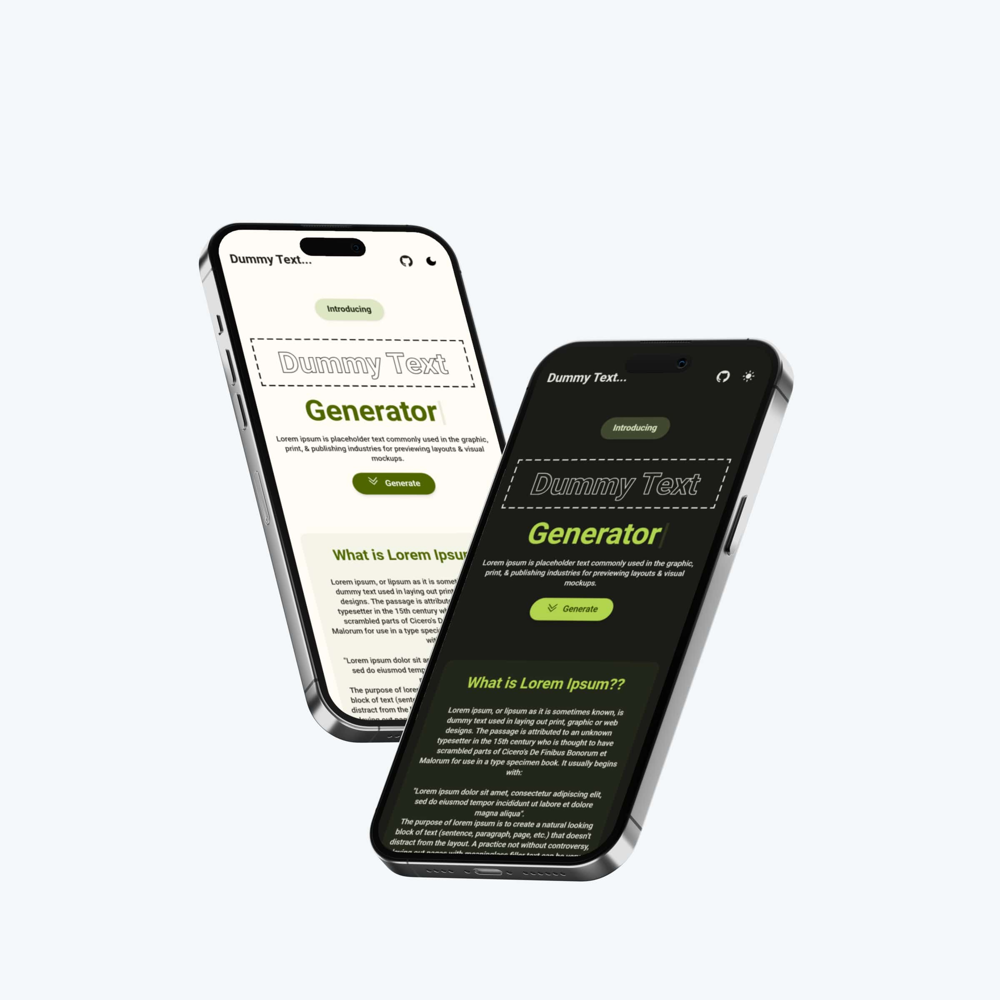

# Dummy Text Generator

Dummy Text Generator is a text generator for those ever needed to fill a space with temporary text for design or layout purposes? Or maybe you just need some filler text to test out a new font or layout style.With just a few clicks, you can generate paragraphs, sentences, or even entire documents of dummy text, also known as "Lorem Ipsum" text.

## Table of contents

- [Overview](#overview)
  - [The challenge](#the-challenge)
  - [Mochups](#mockups)
  - [Links](#links)
- [My process](#my-process)
  - [Built with](#built-with)
  - [What I learned](#what-i-learned)
  - [Continued development](#continued-development)
  - [Useful resources](#useful-resources)
- [Author](#author)

## Overview

### The challenge

Users should be able to:

- Easily switch between light and dark themes
- Receive an indication if an invalid input is entered
- Hover over interactive elements to see their hover states
- Generate any number of paragraphs with the click of a button
- View the optimal layout for the app based on your device's screen size

### Mockups

### Links

- Solution URL: [Github Repo](https://github.com/SameerJS6/John-Smilga-React-Solutions/tree/master/08-Lorem-Ipsum-Generator)
- Live Site URL: [Live on Netify](https://dummy-text-generator-singh.netlify.app/)

## My process

- This time, I approached the project differently. Instead of starting with the UI, I began by focusing on the core functionality of the project.
- I started with the form and the text area, using a `div` instead of a `textarea` as the block for generated content.
- Next, I moved on to the buttons.
- The `Reset` button was easy to set up with a function that reset the count and text state. However, building the `Copy` button from scratch proved difficult, as it did not work on mobile browsers.
- I ended up using the [react-copy-to-clipboard](https://www.npmjs.com/package/copy-to-clipboard) NPM package. Lastly, the `Generate` button was straightforward simply submitting the input to the form.
- With the main functionality complete, I moved on to error handling and form input validation, as well as pop-ups for user indications such as error messages and copied notifications.
- After that, the rest of the work was mostly `UI`.
- I began with the basic `Navbar` and implemented the `Darkmode` toggle.
- After that, it only took two hours to complete the remaining UI components.
- Once all components were in place, I refined the styling by changing the border from the default `border: 5px dashed green` to a custom CSS dashed border.
- I then wrote a `Ripple` hook for the buttons and added it.
- I spent nearly 7-8 hours finalizing the colors from [Dopely Colors](https://colors.dopely.top/) for both Light and Dark themes.
- Finally, I added CSS animations and wrote six or seven lines of code for the reveal animations of the components.
- I completed the project with a clean-up and added comments to the code for better understanding of the code and its logic

### Built with

- Flexbox
- [React](https://reactjs.org/) - JS library
- Mobile-first workflow
- CSS custom properties
- CSS Grid & Animations
- Semantic HTML5 markup
- [Dopely Colors](https://colors.dopely.top/) - For Colors
- [React Reveal](https://www.react-reveal.com/docs/) - For Animated on Scroll
- [Tailwind CSS](https://nextjs.org/) - Utility-First CSS Framework

### What I learned

- Things that I learned while developing this project:-

  - How to use slice to generate paragraphs from JSON data.
  - How to set up custom colors in Tailwind config.
  - In-depth knowledge about props and prop drilling in React.
  - More about UI/UX design and micro-interactions for users.
  - How to create the "Googly Input Field Animation."
  - How to think in React and how to divide elements into different components.
  - About colors and how to create a dashed border with custom CSS.
  - How to implement dark mode using localStorage in a React way, i.e., by using useState, useEffect, and useRef.

### Continued development

This was a fun project to build, although I didn't learn anything particularly new or specific. However, I plan to challenge myself in the future by writing more advanced custom hooks.

### Useful resources

- [React Reveal](https://www.react-reveal.com/docs/) - This helped me for Animated the element only when they are reveal to user.
- [Copy to Clipboard](https://www.npmjs.com/package/copy-to-clipboard) - This helped me for building the copy button.

## Author

- Github - [Sameerjs6](https://github.com/SameerJS6)
- Frontend Mentor - [@Sameerjs6](https://www.frontendmentor.io/profile/sameerjs6)
